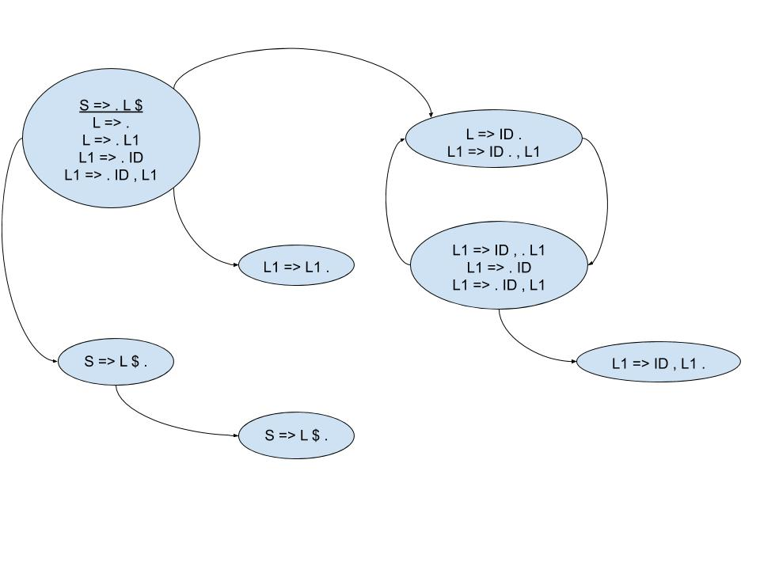

# Análise Sintática

`L = ID | ID ',' L`  
`LV = ε = | L`  

`L = ID | L ',' ID`  
`L = ID | L1 ',' L1`

`L1 = ID | L2`  
`L2 = ε | ',' L1`  

LL - Mantem na pilha o que falta ler  
LR - Mantem na pilha o que já foi lido  

